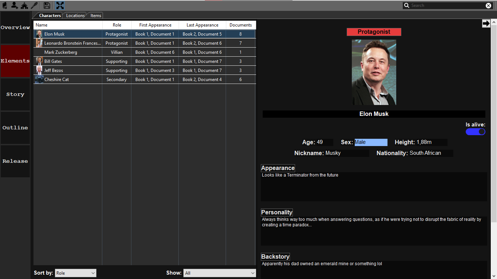
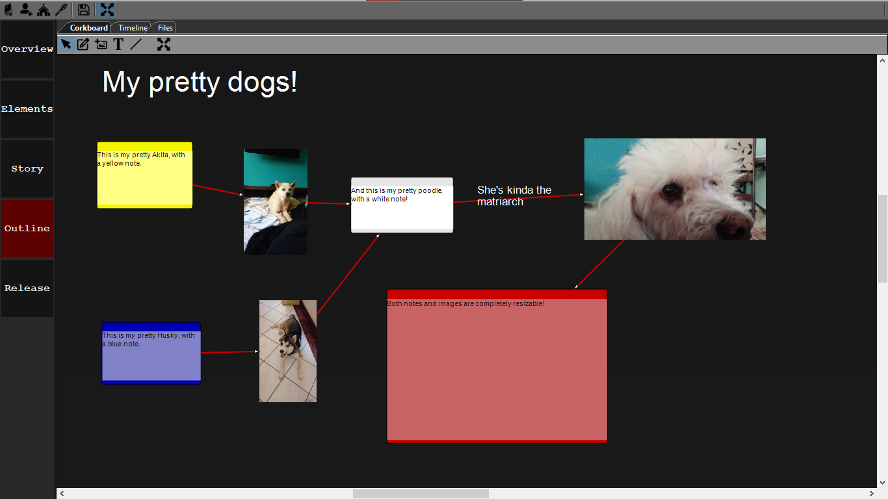
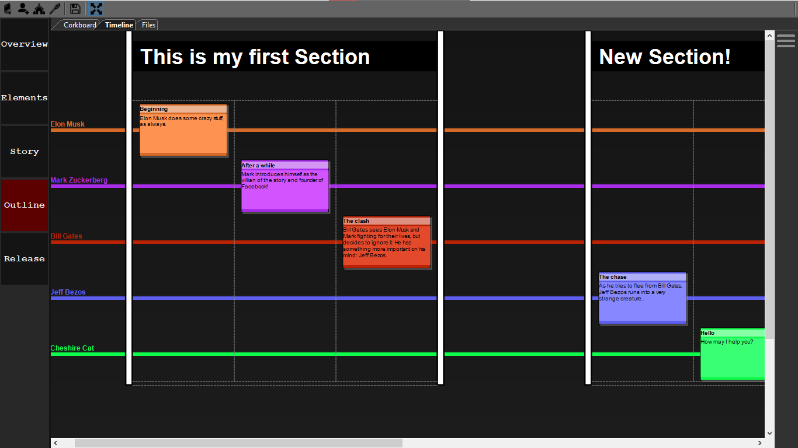
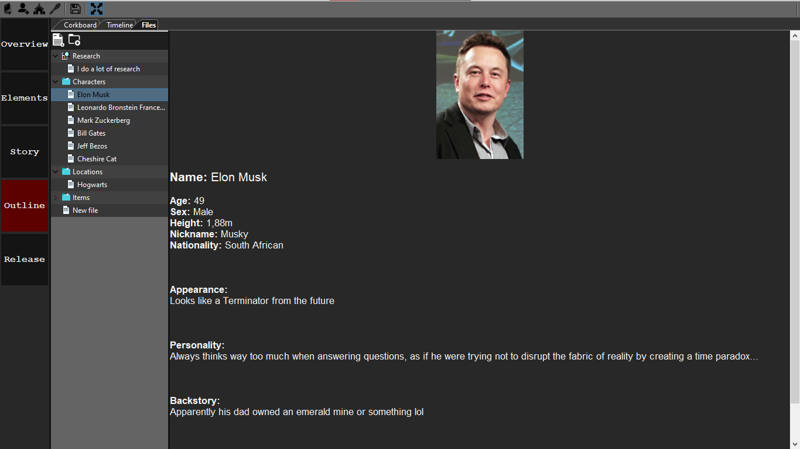
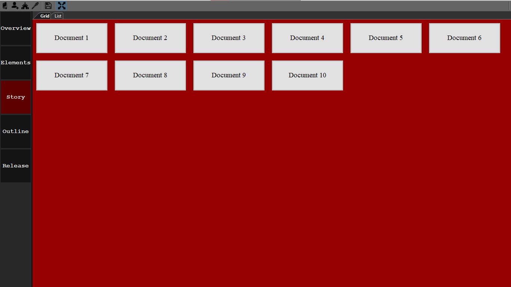
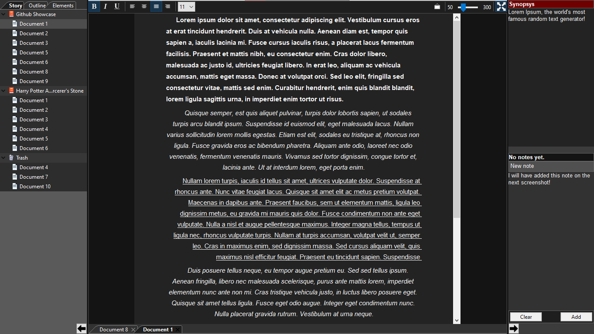

# Amadeus-Writer
### *Work in progress*

  This project aims to be a multifunctional desktop application for fiction writers (or writers in general).
  
  My vision is to have a program that can be utilized in every step of the writing process, incluing the research, the outline, the writing itself, keeping track of characters, locations, items, etc. I plan to add tools such as a drawing board for sketching your own drawings, an integraded video player, a built-in Google extension, a timeline, online social features and more. I'm currently working full time on this.
  
  For now, you can already create characters and locations, specifying lots of attributes in each of them, you can use the famous corkboard for outlining, creating notes, changing colors, adding images, connecting stuff around... There's also a more standard file system for outlining. You can create chapters and write in each of them, changing the font weight and style, keep track of the characters and locations present in the chapter, add notes to it (which can be green or red, you can change the color anytime). There is a save option to save all of these components and the chapter writing has an autosave function, including word count. There are screenshots at the end.
  
## Contribute to the project
 
  This is my first real public project, so I'm fairly new to GitHub. If you're a developer, feel free to contact me or just open Pull Requests and that'll be much appreciated. If you're a writer, you can download the application and test it's current features, leaving some feedback in the "Discussions" section on suggestions of new features or improvements of existing ones.
  
## Where to get it

  For now you can download the executable (Amadeus.exe) from the Release folder and simply run it, it should run on all Windows devices (Mac and Linux builds will come soon). Beware of the fact that the program is very far from finished and you should *not* use it for writing, as there is no export option yet, so everything you write in each chapter will be saved but enssentialy useless (unless you copy them somewhere else manually, but that will result in the loss of bold, italic and underline decorations).
  
## Build

  wxWidgets, wxShapeFramework, and wxSQLite3 are used on the project, so you'll need to have those linked. The solution links the last two to $(WXWIN)\3rdparty, so you can just open it and the project will most likely be ready.
  You have to replace the files at your current wxSF library with the ones at "Edited-wxSF-files", then rebuild it. That makes some things made with the changes on this application possible.

## Notes
  
  - If you do test the program yourself, your antivirus may block it from saving, as that requires writing data to your computer such as folders, images and files. To overcome that you'll have to figure out a way to prevent your antivirus from blocking it.
  
  - Whenever you save, a file will be generated in the same directory as the one where the executable is located, so it's best to keep the program in a seperate folder. The filename will be 88165468. You shouldn't do anything with it, it helps the program automatically load the last saved project whenever you started, making it easier to just run the executable and have your project ready for use. It has to be located in the same folder as the executable.
  
  - When you save a project, a folder will be created in whatever directory you chose. Inside it, ther will be some more folders and a .amp file. To open it, you'll have to either right click it, choose "Open with..." and look for Amadeus or open the application, select "File", "Open File" and then choose that .amp file, which contains the necessary information for the project.
  
  - One the outlining page, you'll see the corkboard. To move it around, drag it with the right mouse button. You can create notes, text and add images through the toolbar - select a mode, then left click the corkboard. To drag those, use the left mouse button. You can change the colors of the notes by right clicking the bar at the top of each one. To connect elements with nodes, choose the line mode at the toolbar and left click an element. This will start a connection, which can be finished by left clicking the target element. You can delete the connections by selecting them and hitting delete.
  
  - The program opens on a blank screen, which is the "Overview" page, the main page. I haven't designed it yet, so it may look weird initially. It'll be like the main hub, with useful information about the current state of the book, characters, etc.
  
  - The file size is currently pretty large, 20Mb+, but that's because all of the assets (icons, background images..) are embedded in the executable for convinence reasons. The application by itself takes about 6Mb of storage (for now).

  - For now you can test out everything for free, but someday when I finish it I do plan to put it up for sale. The price won't be anything huge though, definitely one of the cheapest alternatives in the market compared to things like Scrivener, Vellum (which are both great apps!) and subscription-based software. I hope you all enjoy writing *with it* as much as I am writing *it*! 

## Screenshots

